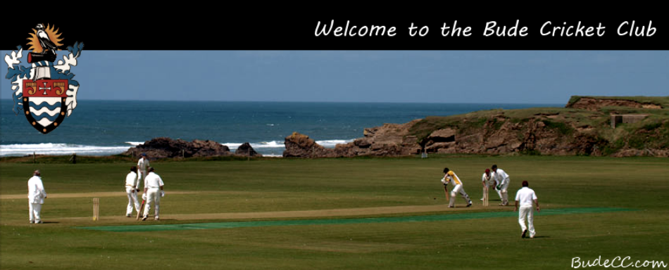
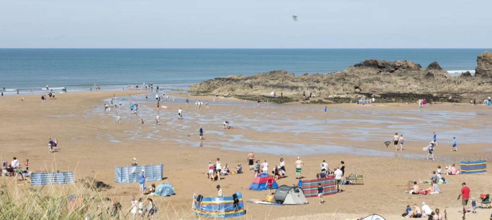
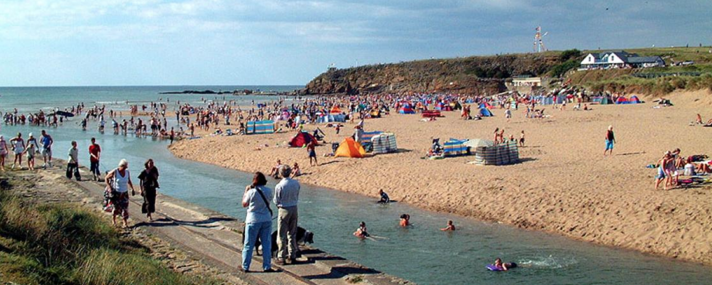
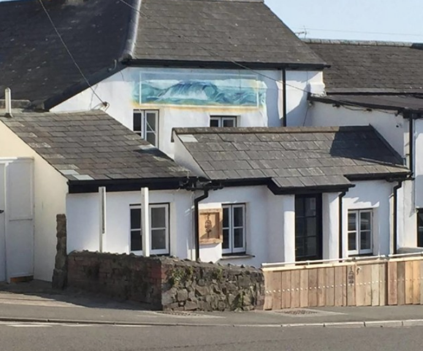

```{r,echo=FALSE}
load("mapdata.RData")
```

## Maps of Bude
### Roadmap of Bude
The following map is a map of Bude, England centered on their local cricket club called Bude North Cornwall Cricket Club. There are two local beaches called Crooklets Beach and Summerleaze Beath in close proximity to the cricket club. Lastly, after a fun game of cricket, players and their friends and family can go to one of the local pubs called "The Barrel at Bude" for an after game drink. For convenience, a route to the bar is highlighted in brown.

```{r,echo=FALSE}
roadmap
```

\newpage

### Watercolor Map of Bude
For those who enjoy watercolors, the following is the same map as the one above, but done in watercolor.

```{r,echo=FALSE}
watercolor
```

\newpage

## Notable and Interesting Sights
### Bude North Cornwall Cricket Club
Bude North Cornwall Cricket Club was founded in 1870. There were no professional teams at this club until the 1970s. Currently, there are three senior teams playing in the regional divisions of Bude.


[Information Source](http://budecc.play-cricket.com/)
[Image Source](https://www.facebook.com/BudeCc/photos/a.132423586915176.28863.132421323582069/163355680488633/?type=3&theater)

### Crooklets Beach
A beach that is very popular amongst surfers, Crooklets Beach also has a surfing club of its own called the Bude Surf Life Saving Club. There are other attractions at this beach such as a skate park, play area, and beach cafe. Beach huts can also be rented for £10-20.


[Information and Image Source](https://www.visitcornwall.com/beaches/lifeguards-seasonal/north-coast/bude/crooklets-beach)

\newpage

### Summerleaze Beach
Another beach near the cricket grounds is called Summerleaze beach and is also suitable for surfing. Much like Crooklets Beach, beach huts can also be rented for £10-20. A particularly interesting attraction is the sea pool that is located at the foot of the cliffs.


[Information and Image Source](https://www.visitcornwall.com/beaches/lifeguards-seasonal/north-coast/bude/summerleaze-beach)

### The Barrel at Bude
Located in one of the oldest buildings in Bude is the Barrel at Bude pub. They have a fine selection of craft ales and Cornish ales. In addition, they offer traditional Cornish snacks.


[Information Source](http://www.micropubassociation.co.uk/micropubs/the-barrel-at-bude/)
[Image Source](http://www.micropubassociation.co.uk/micropubs/the-barrel-at-bude-2/)
